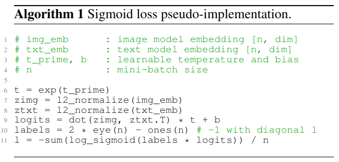

# Distributed Sigmoid Loss

Unofficial PyTorch implementation for the loss function from [Sigmoid Loss for Language Image Pre-Training](https://arxiv.org/abs/2303.15343). **This code hasn't been reviewed yet.**

### TL;DR

This is a distributed implementation for Sigmoid Loss. This distributed implementation supports training on multi-GPUs.

## Sigmoid Loss Overview

Zhai et al. proposed Sigmoid loss for Language Image Pre-training. This new loss is supposed to be a better alternative for InfoNCE ([Clip](https://arxiv.org/abs/2103.00020)) loss. Concretely, Sigmoid loss promises better convergence especially with smaller batch-sizes (Fig. 2) and noisier datasets (Fig. 7). Zhai et al. presented a pseudo implementation for Sigmoid Loss as follows

While helpful, this pseudo implementation assumes a single GPU. Yet, Vision-Language models are always trained on multiple GPUs. So, this repos delivers a distributed sigmoid loss implementation using PyTorch to run on multiple-GPUs.

### Usage Notes

- This code works with DistributedDataParallel (DDP) only and not DataPrallel (DP).
- Please make sure to pass the loss parameters (t_prime, bias) to your optimizer (e.g., Adam optimizer). These parameters ought to be updated during training.

### MISC Notes

- I am currently looking for people to review this code.
- Credit is due for [KeremTurgutlu](https://gist.github.com/KeremTurgutlu) as I am borrowing some of [his code](https://gist.github.com/KeremTurgutlu/4a6f7078dc62f292c85b9903197c75f7)

## Release History

- 1.0.0
  - First code commit on 23 Sep 2023
